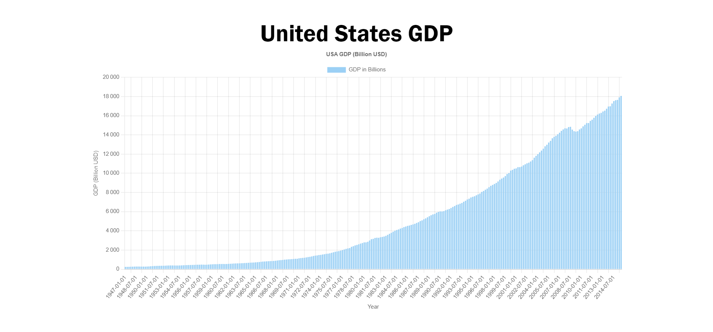

# USA GDP Bar Chart

This project is a straightforward bar chart showcasing the United States' Gross Domestic Product (GDP) over time. It utilizes modern web technologies, including Vite, React, TypeScript, Chart.js, and React-Chartjs-2.

## Features

Visualizes USA GDP data over time.
Responsive design for various screen sizes.
Interactive tooltips for detailed information.

## Technologies Used

This project leverages the following technologies:

**Vite**: A fast development build tool.  
**React**: A popular JavaScript library for building user interfaces.  
**TypeScript**: A statically typed superset of JavaScript.  
**Chart.js**: A JavaScript charting library.  
**React-Chartjs-2**: A React wrapper for Chart.js.  

## Data Source

The GDP data utilized in this project originates from [this source](https://raw.githubusercontent.com/freeCodeCamp/ProjectReferenceData/master/GDP-data.json). You can easily replace it with your own data source by modifying the code in the project.

## License

This project is licensed under the MIT License - see the LICENSE file for details.

## Acknowledgments

This project was inspired by the need to visualize economic data in a simple and interactive way. Special thanks to the maintainers of Vite, React, TypeScript, Chart.js, and React-Chartjs-2 for their fantastic work in the open-source community.

Feel free to fork and modify this project to suit your needs or use it as a starting point for your own data visualization projects. Enjoy exploring the world of data visualization!
